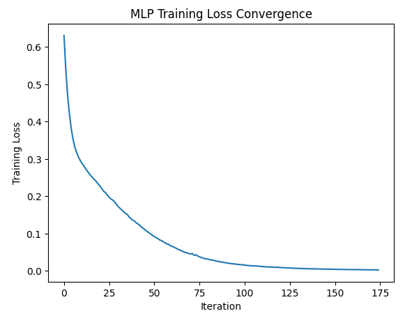

# Skill Assisessment Handwritten Digit Recognition using MLP
## AIM:
To Recognize the Handwritten Digits using Multilayer perceptron.
##  EQUIPMENTS REQUIRED:
Hardware – PCs
Anaconda – Python 3.7 Installation / Google Colab /Jupiter Notebook
## ALGORITHM:
### STEP 1:
Import the required libraries: numpy, pandas, MLPClassifier, train_test_split, StandardScaler, accuracy_score, and matplotlib.pyplot.
### STEP 2:
Load the heart disease dataset from a file using pd.read_csv().
### STEP 3:
Separate the features and labels from the dataset using data.iloc values for features (X) and data.iloc[:, -1].values for labels (y).
### STEP 4:
Split the dataset into training and testing sets using train_test_split().
### STEP 5:
Normalize the feature data using StandardScaler() to scale the features to have zero mean and unit variance.
### STEP 6:
Create an MLPClassifier model with desired architecture and hyperparameters, such as hidden_layer_sizes, max_iter, and random_state.
### STEP 7:
Train the MLP model on the training data using mlp.fit(X_train, y_train). The model adjusts its weights and biases iteratively to minimize the training loss.
### STEP 8:
Make predictions on the testing set using mlp.predict(X_test).
### STEP 9:
Evaluate the model's accuracy by comparing the predicted labels (y_pred) with the actual labels (y_test) using accuracy_score().
### STEP 10:
Print the accuracy of the model.
### STEP 11:
Plot the error convergence during training using plt.plot() and plt.show().

## PROGRAM:
```
Name : Paarkavy B
Reg No : 212221230072
```

```
import numpy as np
import pandas as pd
from sklearn.neural_network import MLPClassifier
from sklearn.model_selection import train_test_split
from sklearn.preprocessing import StandardScaler
from sklearn.metrics import accuracy_score
import matplotlib.pyplot as plt

# Load the dataset
data=pd.read_csv('heart.csv')

# Separate features and labels
x=data.iloc[:,:-1].values
y=data.iloc[:,-1].values

# Split the dataset into training and testing sets
x_train,x_test,y_train,y_test=train_test_split(x,y,test_size=0.2,random_state=42)

# Normalize the feature data
scaler=StandardScaler()
x_train=scaler.fit_transform(x_train)
x_test=scaler.transform(x_test)

# Create and train the MLP model
mlp=MLPClassifier(hidden_layer_sizes=(100,100),max_iter=1000,random_state=42)
training_loss=mlp.fit(x_train,y_train).loss_curve_

# Make prediction on the testing set
y_pred=mlp.predict(x_test)

# Evaluate the model
accuracy=accuracy_score(y_test,y_pred)
print('Accuracy:',accuracy)

# Plot the error convergence
plt.plot(training_loss)
plt.title("MLP Training Loss Convergence")
plt.xlabel("Iteration")
plt.ylabel("Training Loss")
plt.show()
```

## OUTPUT:


## RESULT:
Thus, an ANN with MLP is constructed and trained to predict the heart attack using python.
